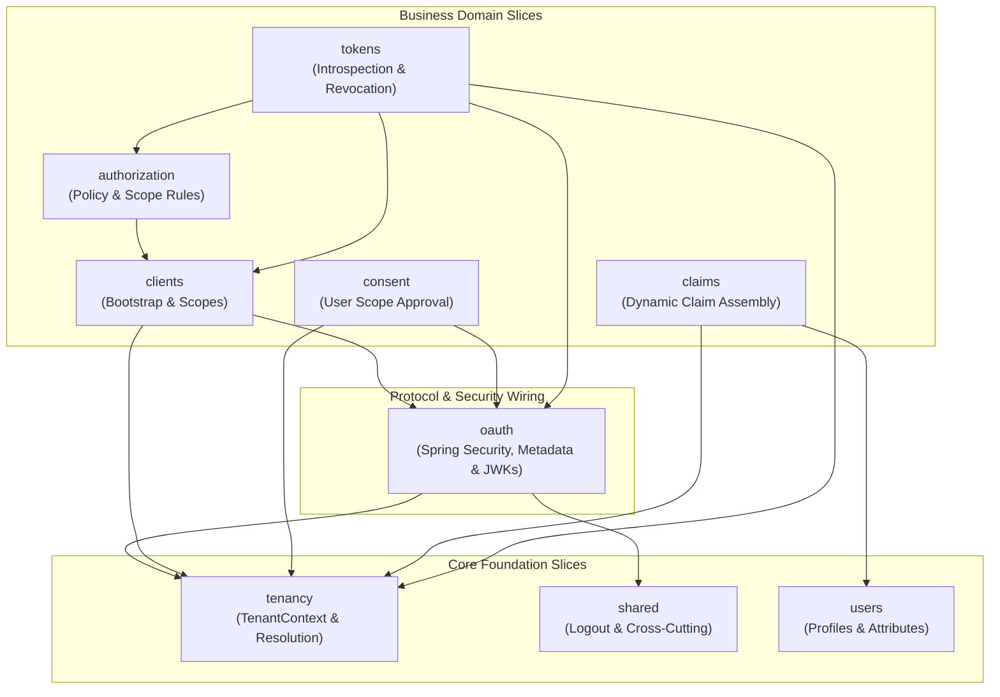
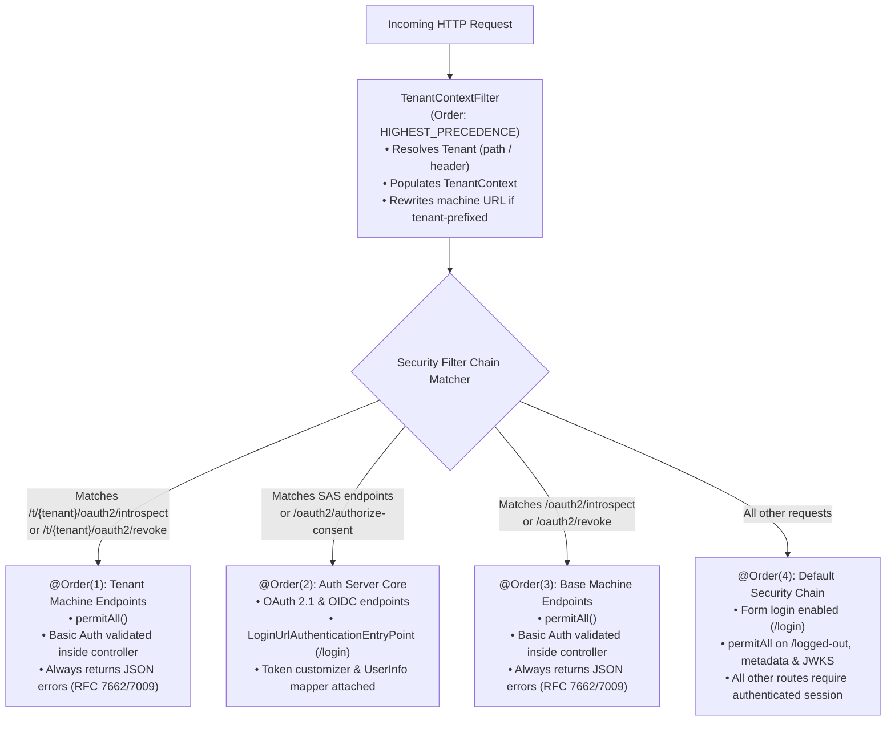
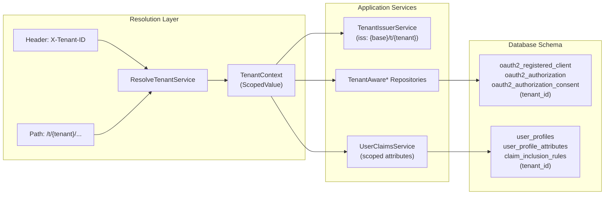
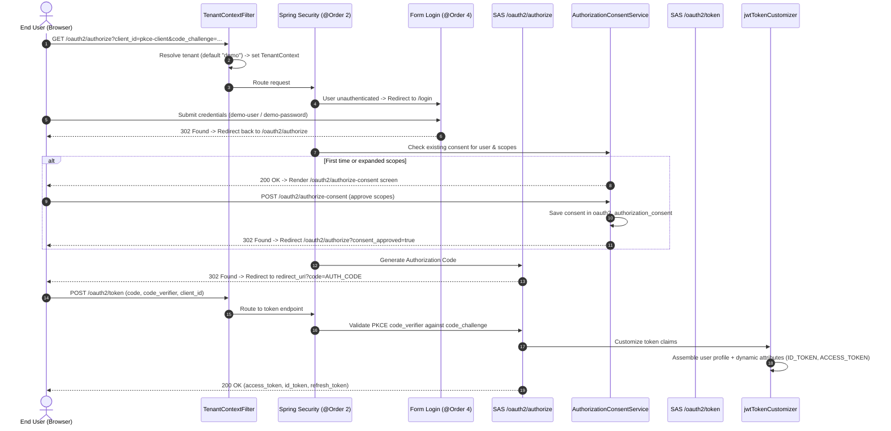
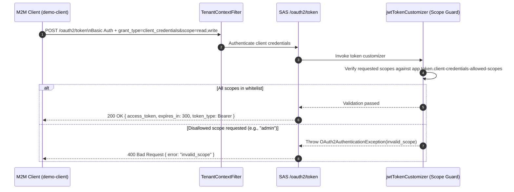
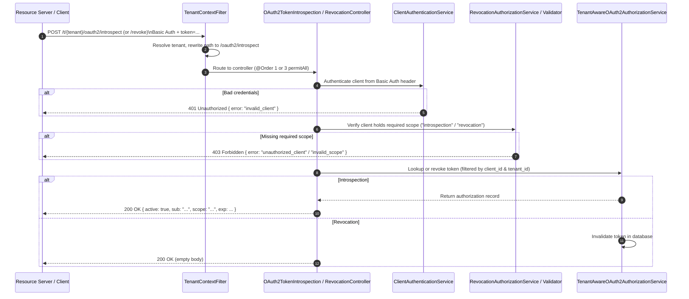
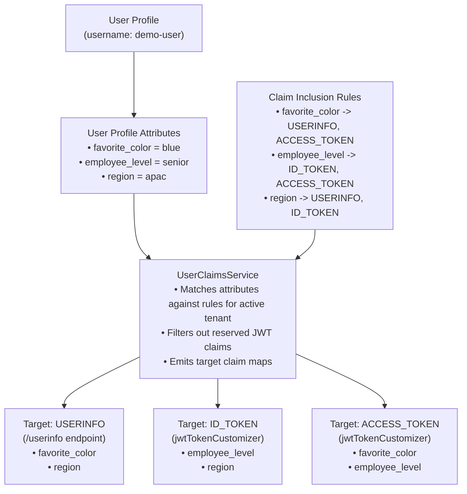

# Architecture & System Design

ed-idp is built as a **Vertical-Slice Modular Monolith** on **Java 25**, **Spring Boot 4.1.1**, **Spring Authorization Server**, and **Spring Modulith**. It functions as an enterprise-grade multi-tenant Identity Provider (IdP) and Authorization Server issuing OAuth 2.1 and OpenID Connect 1.0 tokens.

---

## 1. Architectural Principles

1. **Vertical-Slice Modularity**: The codebase is partitioned by business capabilities (e.g., `tenancy`, `tokens`, `claims`, `consent`, `clients`, `authorization`) rather than technical layers (`controllers`, `services`, `repositories`). Each feature owns its domain models, services, repositories, and endpoints.
2. **Spring Modulith Boundary Enforcement**: Package-level module boundaries are declared via `@ApplicationModule` in `package-info.java` files. Cyclic dependencies are prohibited, and cross-module access is restricted to declared dependencies.
3. **Multi-Tenant by Design**: Tenancy is a foundational architectural concern. Every authorization, client registration, consent, user profile, and claim rule is scoped by `tenant_id` at runtime and in persistence.
4. **Decoupled Security Filter Chains**: Specialized filter chains handle distinct traffic types (machine JSON APIs vs. interactive browser sessions vs. standard OAuth2 protocol endpoints) to eliminate configuration conflicts and unintended HTML redirects.

---

## 2. Spring Modulith Module Architecture

The application is structured into 9 cohesive modules. Dependencies between modules are unidirectional and strictly governed.

### Module Dependency Graph

### Module Responsibilities & Allowed Dependencies

| Module Package | Responsibilities | Allowed Dependencies | Key Classes |
|---|---|---|---|
| [`tenancy/`](../../src/main/java/io/github/edmaputra/edidp/tenancy) | Request tenant resolution, thread-local context management, per-tenant dynamic issuer URLs. | *None* (Foundation) | `TenantContextFilter`, `ResolveTenantService`, `TenantContext`, `TenantIssuerService` |
| [`users/`](../../src/main/java/io/github/edmaputra/edidp/users) | User profile entities, custom dynamic attributes, persistence repositories. | *None* (Foundation) | `UserProfile`, `UserProfileAttribute`, `UserProfileRepository`, `UserProfileAttributeRepository` |
| [`shared/`](../../src/main/java/io/github/edmaputra/edidp/shared) | Cross-cutting endpoints and shared web resources. | *None* (Foundation) | `LoggedOutController` |
| [`oauth/`](../../src/main/java/io/github/edmaputra/edidp/oauth) | Security filter chains, OIDC metadata/JWKS endpoints, tenant-aware JDBC repository adapters. | `tenancy`, `shared` | `SecurityConfig`, `TenantOidcMetadataController`, `TenantJwksController`, `TenantAware*` repositories |
| [`clients/`](../../src/main/java/io/github/edmaputra/edidp/clients) | Client registration bootstrap, client credential authentication, scope verification. | `tenancy`, `oauth` | `ClientBootstrapService`, `ClientAuthenticationService`, `ClientScopeService` |
| [`authorization/`](../../src/main/java/io/github/edmaputra/edidp/authorization) | Scope validation rules and authorization policy evaluations. | `clients` | `AuthorizationPolicyService`, `ValidateScopeCommand` |
| [`consent/`](../../src/main/java/io/github/edmaputra/edidp/consent) | Interactive consent review, user scope approval flow, consent persistence. | `tenancy`, `oauth` | `AuthorizationConsentService`, `ConsentStore`, `OAuth2AuthorizationConsentController` |
| [`claims/`](../../src/main/java/io/github/edmaputra/edidp/claims) | Dynamic claim filtering and assembly across UserInfo, ID Tokens, and Access Tokens. | `users`, `tenancy` | `UserClaimsService`, `UserClaimsDataProvider`, `ClaimInclusionRuleRepository` |
| [`tokens/`](../../src/main/java/io/github/edmaputra/edidp/tokens) | RFC 7662 Token Introspection, RFC 7009 Token Revocation, token policy configurations. | `authorization`, `clients`, `tenancy`, `oauth` | `IntrospectTokenService`, `RevokeTokenService`, `TokenRevoker`, `TokenPolicyProperties` |

---

## 3. Multi-Tier Security Filter Chain Architecture

Spring Security is configured with **four ordered filter chains** plus a pre-security servlet filter registered at highest precedence. This separation prevents browser login redirects on machine-to-machine APIs while ensuring interactive authorization flows remain strictly protected.

### Chain Details

1. **`TenantContextFilter` (`FilterRegistrationBean`, `HIGHEST_PRECEDENCE`)**:
   - Inspects the URI path (`/t/{tenant}/...`) and incoming HTTP headers (`X-Tenant-ID`).
   - If tenant is present on a machine path (e.g. `/t/demo/oauth2/introspect`), it rewrites the request URI internally to the canonical path (`/oauth2/introspect`) while keeping `TenantContext` populated.
   - Binds the resolved tenant to the current thread via `TenantContext.setCurrentTenant(...)` and reliably clears it in a `finally` block.
2. **`@Order(1)` — `tenantMachineEndpointsFilterChain`**:
   - Matches: `/t/{tenant}/oauth2/introspect` and `/t/{tenant}/oauth2/revoke`.
   - Security: Configured as `permitAll()`. Authentication is performed programmatically by `ClientAuthenticationService` inside the controller, ensuring RFC-compliant `401 Unauthorized` / `403 Forbidden` JSON responses instead of HTML redirects.
3. **`@Order(2)` — `authorizationServerSecurityFilterChain`**:
   - Matches: Standard Spring Authorization Server endpoints (`/oauth2/authorize`, `/oauth2/token`, `/oauth2/jwks`) and custom consent (`/oauth2/authorize-consent`).
   - Hooks: Attaches `userInfoMapper` (UserInfo claims) and `jwtTokenCustomizer` (dynamic claims and M2M scope enforcement).
   - Exception Handling: Sets `LoginUrlAuthenticationEntryPoint("/login")` for HTML requests.
4. **`@Order(3)` — `introspectionFilterChain`**:
   - Matches: Canonical non-tenant paths `/oauth2/introspect` and `/oauth2/revoke`.
   - Security: `permitAll()` allowing custom M2M controller authentication.
5. **`@Order(4)` — `defaultSecurityFilterChain`**:
   - Matches: All remaining application endpoints.
   - Security: Form login with default Spring Security login page. Public access permitted for `/logged-out`, tenant discovery (`/t/*/.well-known/openid-configuration`), and tenant JWKS (`/t/*/oauth2/jwks`).

---

## 4. Multi-Tenancy & Data Isolation Model

Tenancy is isolated at every layer: request routing, identity propagation, metadata, token claims, and relational persistence.

### Tenancy Mechanisms

- **Dynamic Per-Tenant Issuer**: `TenantIssuerService.resolveTenantIssuer(baseIssuer, tenantId)` generates `{baseIssuer}/t/{tenantId}`. This dynamically qualifies:
  - OIDC Discovery: `GET /t/{tenant}/.well-known/openid-configuration`
  - Per-tenant JWKS: `GET /t/{tenant}/oauth2/jwks`
  - Issued JWT claims: `iss = http://localhost:9000/t/{tenant}`
- **Repository Decorators**: Rather than forking Spring Authorization Server's JDBC layer, custom decorators wrap Spring's classes:
  - `TenantAwareRegisteredClientRepository` (extends `JdbcRegisteredClientRepository`)
  - `TenantAwareOAuth2AuthorizationService` (extends `JdbcOAuth2AuthorizationService`)
  - `TenantAwareOAuth2AuthorizationConsentService` (extends `JdbcOAuth2AuthorizationConsentService`)
  Every lookup and save transparently stamps and filters by `TenantContext.getCurrentTenantOrDefault("demo")`.
- **Database Schema Isolation**: Flyway migration `V0_0_1_007` added `tenant_id` columns with composite indexes across all tables:
  - `(tenant_id, client_id)`
  - `(tenant_id, principal_name)`
  - `(tenant_id, username, attribute_key)`

---

## 5. End-to-End Request Lifecycles

### 5.1 Interactive Authorization Code Flow with PKCE & Consent

### 5.2 Machine-to-Machine Token Issuance & Scope Whitelist Enforcement

### 5.3 RFC 7662 Token Introspection & RFC 7009 Revocation

---

## 6. Dynamic Claims & Profile Routing Pipeline

The dynamic claims subsystem decouples user attribute storage from token claim issuance, enabling declarative claim routing based on database rules rather than hardcoded logic.

### Claim Security Rules

1. **Reserved Claim Protection**: The claim engine strictly disallows user attributes from overriding reserved JWT/OIDC claims:
   `sub`, `iss`, `aud`, `exp`, `iat`, `nbf`, `jti`, `scope`, `client_id`, `azp`, `token_type`, `auth_time`, `nonce`, `at_hash`, `c_hash`, `sid`, `amr`, `acr`.
2. **Tenant Scoping**: Attribute lookups and rule evaluations are filtered by the current `TenantContext`. Attributes belonging to `tenant-a` are invisible to `tenant-b`.

---

## 7. Configuration & Token Policy Controls

Token lifetimes, refresh rotation, and client credential scope constraints are bound via `TokenPolicyProperties` (`@ConfigurationProperties("app.token")`):

| Property | Default | Architectural Purpose |
|---|---|---|
| `app.token.access-token-time-to-live` | `5m` | Access token lifespan applied directly to SAS `TokenSettings`. |
| `app.token.refresh-token-time-to-live` | `7d` | Refresh token lifespan applied directly to SAS `TokenSettings`. |
| `app.token.reuse-refresh-tokens` | `false` | Refresh token rotation policy: when `false`, each refresh issues a new single-use refresh token and invalidates the previous one. |
| `app.token.client-credentials-allowed-scopes` | `read,write,introspection,revocation` | Scope boundary for M2M tokens enforced by the scope guard in `jwtTokenCustomizer`. |
| `tenant.resolution.header-enabled` | `true` | Enables `X-Tenant-ID` header resolution. |
| `tenant.resolution.path-enabled` | `true` | Enables `/t/{tenant}/...` path resolution. |
| `tenant.resolution.require-explicit-tenant` | `false` | Strict mode: rejects un-tenanted requests with `400 Bad Request` instead of defaulting to `demo`. |

---

## 8. Related Documentation

- [Documentation Portal](../README.md)
- [Executive Features & Roadmap](../features-and-roadmap.md)
- [OAuth 2.0 Authorization Server](../features/01-oauth2-authorization-server.md)
- [OpenID Connect (OIDC)](../features/02-openid-connect.md)
- [Multi-Tenancy Details](../features/03-multi-tenancy.md)
- [Token Policy & Lifetime Controls](../features/04-token-policy.md)
- [Dynamic Claims Architecture](../features/05-dynamic-claims.md)
- [Token Introspection (RFC 7662)](../features/06-token-introspection.md)
- [Token Revocation (RFC 7009)](../features/07-token-revocation.md)
- [User Consent Flow](../features/08-consent.md)
- [Client Management & Bootstrap](../features/09-client-management.md)
- [Session & Logout](../features/10-session-logout.md)
- [Persistence & Flyway Schema](../features/11-persistence-schema.md)
- [Configuration Reference](../features/12-configuration.md)
