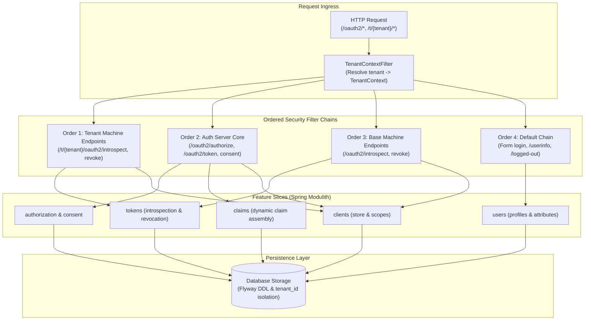
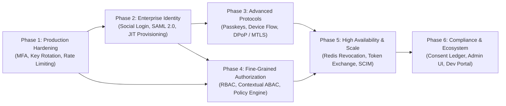

# Features and Roadmap: `ed-auth` (OAuth 2.1 & OIDC Authorization Server)

`ed-auth` (internally named `enhauthserv`) is a multi-tenant OAuth 2.1 and OpenID Connect 1.0 Identity Provider (IdP) and Authorization Server built on **Java 21**, **Spring Boot 3.5.x**, **Spring Authorization Server**, and **Spring Modulith**. It delivers strict per-tenant isolation, dynamic claim assembly, RFC-compliant token introspection and revocation, configurable token policies, and PKCE-enforced authorization flows.

> **Documentation Portal**: See [docs/README.md](README.md) for the complete table of contents and [Architecture & System Design](architecture/00-architecture.md) for deep technical design and sequence flows.

---

## 1. Current Features (v0.0.1-SNAPSHOT)

### 1.1 Multi-Tenant Core Architecture
> Detailed specification: [features/03-multi-tenancy.md](features/03-multi-tenancy.md)

- **Tenant Context Resolution**: `TenantContextFilter` (highest-priority `OncePerRequestFilter`) resolves tenant identity from the request path (`/t/{tenant}/...`) or via HTTP headers (`X-Tenant-ID`), with configurable strict rejection (`require-explicit-tenant`) and proxy trust controls.
- **Thread-Local Tenancy Propagation**: `TenantContext` maintains thread-bound tenant state across filters, services, and persistence layers with guaranteed cleanup.
- **Dynamic Per-Tenant Issuer (`TenantIssuerService`)**: Automatically resolves and advertises per-tenant issuers (`{baseIssuer}/t/{tenantId}`) across OpenID configuration discovery, JWKS sets, and token `iss` claims.
- **Tenant-Scoped Authorization Services**: Custom repository decorators extending Spring Authorization Server's JDBC layer (`TenantAwareRegisteredClientRepository`, `TenantAwareOAuth2AuthorizationService`, `TenantAwareOAuth2AuthorizationConsentService`) automatically partition clients, authorizations, and consents by tenant.
- **Database Schema Namespacing**: Flyway migrations enforce tenant isolation across all state tables (`oauth2_registered_client`, `oauth2_authorization`, `oauth2_authorization_consent`, `users`, `authorities`, `user_profile_attributes`, `claim_inclusion_rules`) using `tenant_id` columns and composite indexes.

### 1.2 OAuth 2.1 & OpenID Connect Core
> Detailed specifications: [features/01-oauth2-authorization-server.md](features/01-oauth2-authorization-server.md) · [features/02-openid-connect.md](features/02-openid-connect.md) · [features/10-session-logout.md](features/10-session-logout.md)

- **Comprehensive Grant Type Support**: Full implementation of `authorization_code`, `client_credentials`, and `refresh_token` flows.
- **Mandatory PKCE for Public Clients**: Native app and SPA clients (`pkce-public-client`) require RFC 7636 Proof Key for Code Exchange (`code_challenge` / `S256`) with `none` client authentication.
- **Client Authentication Options**: Flexible client authentication supporting `client_secret_basic` (HTTP Basic) and `client_secret_post` (form body).
- **OIDC Discovery & Metadata (RFC 8414)**: Dynamic tenant-aware metadata endpoint (`/t/{tenant}/.well-known/openid-configuration`) publishing endpoints, signing keys, grant types, and scopes.
- **Per-Tenant JWK Sets (`/oauth2/jwks` · `/t/{tenant}/oauth2/jwks`)**: Per-tenant RSA public key sets for decoupled downstream JWT verification.
- **OIDC UserInfo Endpoint (`/userinfo`)**: Bearer-authenticated profile claim delivery conforming to OpenID Connect Core 1.0.
- **RP-Initiated Logout (`/connect/logout`)**: Standard session termination endpoint supporting `id_token_hint` and `post_logout_redirect_uri`, redirecting to a customizable confirmation page (`/logged-out`).

### 1.3 Token Policy & Dynamic Claim Engine
> Detailed specifications: [features/04-token-policy.md](features/04-token-policy.md) · [features/05-dynamic-claims.md](features/05-dynamic-claims.md)

- **Configurable Token Lifetimes (`TokenPolicyProperties`)**: Zero-code configuration via `app.token.*` for access token TTL (default `5m`), refresh token TTL (default `7d`), and refresh token reuse toggle.
- **Refresh Token Rotation**: Configurable rotation policy (`app.token.reuse-refresh-tokens=false`) issuing a single-use refresh token on each renewal while invalidating previous tokens to mitigate replay attacks.
- **Client-Credentials Scope Guard**: Strict policy enforcement restricting machine-to-machine clients to an explicit whitelist of scopes (`app.token.client-credentials-allowed-scopes`), rejecting privilege escalation with `invalid_scope`.
- **Dynamic Attribute-Based Claims**: Arbitrary custom attributes attached to users (`user_profile_attributes`) dynamically routed to one or more claim targets (`USERINFO`, `ID_TOKEN`, `ACCESS_TOKEN`) via database-driven rules (`claim_inclusion_rules`).
- **Reserved Claim Protection**: Built-in safeguards preventing custom user attributes from overriding core JWT/OIDC claims (`sub`, `iss`, `aud`, `exp`, `iat`, `jti`, `nonce`, `scope`).

### 1.4 Token Introspection & Revocation
> Detailed specifications: [features/06-token-introspection.md](features/06-token-introspection.md) · [features/07-token-revocation.md](features/07-token-revocation.md)

- **Token Introspection (RFC 7662)**: Dedicated endpoint (`/oauth2/introspect` and `/t/{tenant}/oauth2/introspect`) allowing resource servers to validate active status and inspect token claims, guarded by HTTP Basic authentication and the `introspection` scope.
- **Token Revocation (RFC 7009)**: Dedicated endpoint (`/oauth2/revoke` and `/t/{tenant}/oauth2/revoke`) allowing clients to proactively revoke access or refresh tokens, guarded by the `revocation` scope and client-ownership isolation.
- **Multi-Chain Security Architecture**: Ordered Spring Security filter chains ensuring public path rewriting, machine endpoint performance, authorization server isolation, and form-login fallbacks.

### 1.5 Interactive User Consent
> Detailed specification: [features/08-consent.md](features/08-consent.md)

- **Scope Consent Flow (`/oauth2/authorize-consent`)**: Interactive UI flow allowing users to explicitly review and grant individual scopes during authorization-code flows.
- **Tenant-Scoped Consent Ledger**: Approved scopes persisted in `oauth2_authorization_consent` per tenant; returning users automatically bypass the consent screen unless new scopes are requested.

### 1.6 Client & User Bootstrap
> Detailed specification: [features/09-client-management.md](features/09-client-management.md)

- **Idempotent Development Seeding**: `ClientBootstrapService` seeds default confidential (`demo-client`) and public PKCE (`pkce-public-client`) clients on startup.
- **Demo User & Profile Seeding**: Built-in seeding for development testing (`demo-user` with BCrypt password hashing, standard profile metadata, and attribute claim routing).
- **Client Scope Validation Service (`ClientScopeService`)**: Encapsulated service querying client registrations and verifying assigned scopes.

### 1.7 Architectural Foundation & Persistence
> Detailed specifications: [architecture/00-architecture.md](architecture/00-architecture.md) · [features/11-persistence-schema.md](features/11-persistence-schema.md) · [features/12-configuration.md](features/12-configuration.md)

- **Vertical-Slice Modular Monolith**: Codebase structured into clean feature modules (`authorization`, `claims`, `clients`, `consent`, `tenancy`, `tokens`, `users`, `oauth`, `shared`) with dependency rules verified by **Spring Modulith**.
- **Flyway Database Migrations**: Version-controlled DDL migrations managing OAuth2 state, user profiles, and claim rules across SQL schemas.
- **Pluggable Relational Storage**: Out-of-the-box H2 support for rapid local development, fully compatible with enterprise RDBMS (PostgreSQL, MySQL).

---

## 2. Product Roadmap

### Phase 1: Production Hardening & Core Security
> Detailed design: [roadmap/01-authentication.md](roadmap/01-authentication.md) · [roadmap/05-client-management.md](roadmap/05-client-management.md) · [roadmap/07-security-hardening.md](roadmap/07-security-hardening.md)

- [ ] **Multi-Factor Authentication (MFA / TOTP)**: RFC 6238 time-based one-time password verification (Google Authenticator, Microsoft Authenticator) with QR code enrollment and backup recovery codes.
- [ ] **Automated Cryptographic Key Rotation**: Background scheduler rotating RSA/EC signing keys in JWKS with grace periods, publishing multi-key sets (`active`, `next`, `retired`).
- [ ] **Brute-Force & Rate Limiting**: Bucket4j / token-bucket rate limiting on `/oauth2/token`, `/oauth2/authorize`, and login endpoints to mitigate credential stuffing.
- [ ] **Structured Security Audit Logging**: SIEM-ready security audit events emitted on login attempts, token issuance, consent approvals, and revocations.
- [ ] **Dynamic Client Registration (RFC 7591 / RFC 7592)**: RESTful management APIs for client lifecycle operations (registration, secret rotation, scope updates, deactivation).

### Phase 2: Enterprise Identity & Federation
> Detailed design: [roadmap/02-user-lifecycle.md](roadmap/02-user-lifecycle.md) · [roadmap/03-federation.md](roadmap/03-federation.md)

- [ ] **Social Identity Providers**: Out-of-the-box OAuth2/OIDC social login brokering for Google, GitHub, Microsoft, and Apple.
- [ ] **Enterprise SAML 2.0 Web SSO**: Enterprise SAML assertion consumer service (ACS) for corporate and educational identity providers.
- [ ] **Account Linking & Identity Stitching**: Unified user identity linking multiple external federated identities to a single tenant user profile.
- [ ] **Just-In-Time (JIT) Provisioning**: Automated user profile and attribute creation upon first successful external IdP federation.
- [ ] **User Self-Service & Lifecycle**: Self-registration flow, email verification, self-service profile updating, and secure self-service password reset.

### Phase 3: Advanced Protocols & Passwordless Authentication
> Detailed design: [roadmap/01-authentication.md](roadmap/01-authentication.md) · [roadmap/06-protocols.md](roadmap/06-protocols.md)

- [ ] **WebAuthn / FIDO2 Passkeys**: Phishing-resistant biometric and hardware security key authentication (FaceID, TouchID, YubiKey).
- [ ] **Passwordless Magic Links**: Secure, time-limited one-time email login links.
- [ ] **OAuth 2.0 Device Authorization Grant (RFC 8628)**: Dedicated authorization flow for input-constrained devices (CLI tools, smart TVs, IoT hardware).
- [ ] **Client-Initiated Backchannel Authentication (CIBA)**: Decoupled authentication flow for out-of-band mobile authorizations and FAPI compliance.
- [ ] **DPoP (RFC 9449) & Mutual-TLS (RFC 8705)**: Demonstrating Proof-of-Possession and MTLS client-bound tokens preventing token replay and theft.

### Phase 4: Fine-Grained Authorization & Access Control
> Detailed design: [roadmap/04-authorization.md](roadmap/04-authorization.md)

- [ ] **Role-Based Access Control (RBAC)**: Tenant-level roles and granular permission mapping with group-based inheritance.
- [ ] **Attribute-Based Access Control (ABAC)**: Contextual policy engine evaluating dynamic attributes (IP subnet, time of day, geolocation, risk score).
- [ ] **Step-Up & Adaptive Authentication**: Conditional step-up authentication challenges triggered when requesting elevated scopes or based on risk signals (`acr`/`amr` claims).
- [ ] **Authorization Policy Engine Integration**: Pluggable authorization connectors for modern policy backends (OpenFGA, Cedar, OPA).
- [ ] **Token Claim Enrichment**: Injection of compiled authorization entitlements and permission sets directly into access token claims.

### Phase 5: High Availability, Distributed State & Operability
> Detailed design: [roadmap/06-protocols.md](roadmap/06-protocols.md) · [roadmap/08-operability.md](roadmap/08-operability.md)

- [ ] **Distributed Token Blacklisting & Session Cache**: Redis-backed distributed revocation ledger enabling instantaneous global token invalidation.
- [ ] **OAuth 2.0 Token Exchange (RFC 8693)**: Standardized cross-service delegation and impersonation token exchanges.
- [ ] **SCIM 2.0 Provisioning**: Inbound/outbound System for Cross-domain Identity Management endpoint for automated enterprise employee sync.
- [ ] **High Availability (HA) Clustering**: Multi-node horizontal scaling support with distributed session management.
- [ ] **OpenTelemetry Metrics & Distributed Tracing**: Pre-instrumented Prometheus metrics (`auth_requests_total`, `token_issuance_seconds`) and trace propagation.

### Phase 6: Compliance, Admin Console & Developer Ecosystem
> Detailed design: [roadmap/09-compliance.md](roadmap/09-compliance.md) · [roadmap/10-developer-experience.md](roadmap/10-developer-experience.md)

- [ ] **Immutable Consent & Audit Ledger**: Tamper-resistant audit trails for compliance with GDPR, SOC 2, and HIPAA requirements.
- [ ] **GDPR Privacy Tooling**: Automated endpoints for user data export and "Right to be Forgotten" account purging.
- [ ] **Interactive Admin Web Console**: Dedicated management UI for tenant configurations, client management, user directories, and active session monitoring.
- [ ] **Developer Portal & OpenAPI Explorer**: Interactive documentation explorer, live API sandboxes, and Postman collections.
- [x] **Automated CI/CD Pipeline**: GitHub Actions workflows for continuous integration, multi-version Java testing, and Spring Modulith verification.
