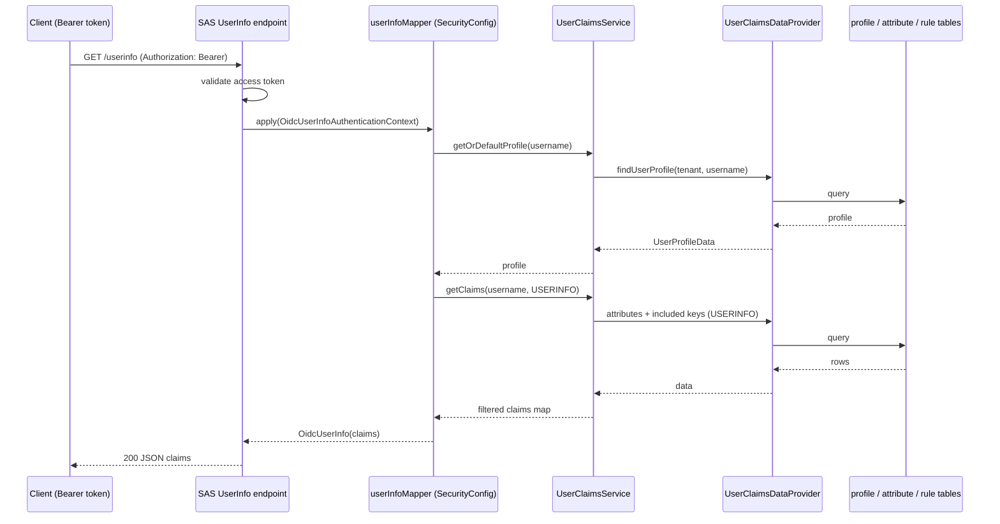

# Feature 2 — OpenID Connect (OIDC)

EnhAuthServ layers OpenID Connect Core 1.0 on top of the OAuth2 server, issuing ID tokens and serving identity endpoints. Discovery and JWKS are tenant-scoped.

## Endpoints

| Endpoint | Method | Purpose |
|---|---|---|
| `/t/{tenant}/.well-known/openid-configuration` | GET | OIDC Discovery metadata (RFC 8414) |
| `/userinfo` | GET | UserInfo — profile claims for the authenticated subject |
| `/t/{tenant}/oauth2/jwks` | GET | Per-tenant signing key set |
| `/connect/logout` | GET | RP-initiated logout (see [Session & Logout](10-session-logout.md)) |

## Discovery document

`TenantOidcMetadataController` builds the discovery document per tenant. The `issuer` and every advertised endpoint are resolved through `TenantIssuerService`, so each tenant gets an issuer of the form `{baseIssuer}/t/{tenant}`. Advertised fields include `issuer`, `authorization_endpoint`, `token_endpoint`, `jwks_uri`, `userinfo_endpoint`, `introspection_endpoint`, `revocation_endpoint`, and `end_session_endpoint`.

## ID token

Issued for the `openid` scope via the OIDC ID-token flow. The `jwtTokenCustomizer` bean injects any attributes whose [claim inclusion rule](05-dynamic-claims.md) targets `ID_TOKEN`.

## UserInfo

The `userInfoMapper` bean returns standard profile fields (`name`, `email`, `locale`, `zoneinfo`, …) from `UserProfile`, plus any attributes whose inclusion rule targets `USERINFO`.

## API contracts

### `GET /t/{tenant}/.well-known/openid-configuration`

No auth. Returns the per-tenant discovery document.

```http
GET /t/demo/.well-known/openid-configuration HTTP/1.1
```

**`200 OK`:**

```json
{
  "issuer": "http://localhost:9000/t/demo",
  "authorization_endpoint": "http://localhost:9000/t/demo/oauth2/authorize",
  "token_endpoint": "http://localhost:9000/t/demo/oauth2/token",
  "jwks_uri": "http://localhost:9000/t/demo/oauth2/jwks",
  "userinfo_endpoint": "http://localhost:9000/t/demo/userinfo",
  "introspection_endpoint": "http://localhost:9000/t/demo/oauth2/introspect",
  "revocation_endpoint": "http://localhost:9000/t/demo/oauth2/revoke",
  "end_session_endpoint": "http://localhost:9000/t/demo/connect/logout"
}
```

### `GET /userinfo`

Requires a Bearer access token issued with the `openid` scope.

```http
GET /userinfo HTTP/1.1
Authorization: Bearer eyJraWQ...
```

**`200 OK`** — standard profile claims plus any attribute whose rule targets `USERINFO`:

```json
{
  "sub": "demo-user",
  "name": "Demo User",
  "email": "demo-user@example.com",
  "email_verified": true,
  "locale": "en-US",
  "zoneinfo": "Asia/Jakarta",
  "favorite_color": "blue",
  "region": "apac"
}
```

**`401 Unauthorized`** with `WWW-Authenticate: Bearer` if the token is missing, expired, or invalid.

### `GET /t/{tenant}/oauth2/jwks`

No auth. Returns the tenant's public signing keys.

```json
{
  "keys": [
    {
      "kty": "RSA",
      "e": "AQAB",
      "kid": "a1b2c3...",
      "n": "0vx7agoebGcQSuu...",
      "use": "sig"
    }
  ]
}
```

### `GET /connect/logout`

RP-initiated logout — see [Session & Logout](10-session-logout.md).

## Standard profile fields

Backed by the `UserProfile` entity: `full_name`, `email`, `email_verified`, `locale`, `zoneinfo`, `department`, `tenant`.

## Implementation

| Concern | Class / file |
|---|---|
| Discovery doc | [`oauth/metadata/TenantOidcMetadataController`](../../src/main/java/io/github/edmaputra/enhauthserv/oauth/metadata/TenantOidcMetadataController.java) |
| JWKS | [`oauth/metadata/TenantJwksController`](../../src/main/java/io/github/edmaputra/enhauthserv/oauth/metadata/TenantJwksController.java) + `JWKSource` bean in `oauth/SecurityConfig.jwkSource()` |
| Per-tenant issuer | [`tenancy/TenantIssuerService`](../../src/main/java/io/github/edmaputra/enhauthserv/tenancy/TenantIssuerService.java) |
| UserInfo mapping | `oauth/SecurityConfig.userInfoMapper(...)` bean (wired into the `@Order(2)` chain's `oidc().userInfoEndpoint()`) |
| ID-token claims | `oauth/SecurityConfig.jwtTokenCustomizer(...)` (branch on `OidcParameterNames.ID_TOKEN`) |
| Claim assembly | [`claims/UserClaimsService`](05-dynamic-claims.md) |

Notes from the code:

- The discovery and JWKS controllers are **custom** (not SAS-provided) because they are tenant-path scoped; they are `permitAll` in the `@Order(4)` chain.
- `userInfoMapper` first puts standard profile fields (`sub`, `preferred_username`, `name`, `email`, `email_verified`, `locale`, `zoneinfo`, `updated_at`, `department`, `tenant`) then merges `getClaims(username, USERINFO)`.

## UserInfo — sequence



## Related tests

- `AuthServerMetadataTests`, `OidcUserInfoEndpointTests`, `OidcLogoutEndpointTests`
