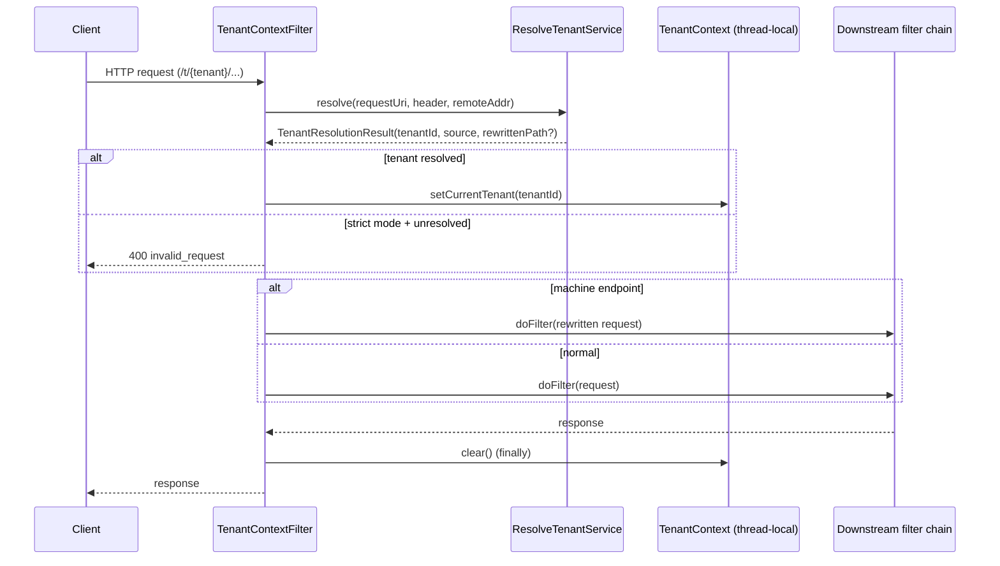

# Feature 3 — Multi-Tenancy

Every piece of OAuth2 state — registered clients, authorizations, consents, users, and profile attributes — is isolated per tenant. Tenant identity is resolved once per request and propagated through a thread-local context.

> **Resolution model:** the tenant is carried in the request path (`/t/{tenant}/...`) and may also be supplied via `X-Tenant-ID` when header resolution is enabled.

## Tenant resolution

`tenancy/TenantContextFilter` (Spring `OncePerRequestFilter`, **highest precedence**) delegates to `ResolveTenantService`, which resolves the tenant from the request path and/or trusted header:

1. **Path** (if `path-enabled`) — pattern `/t/{tenant}/...`. For machine endpoints, the path is rewritten (e.g. `/t/{tenant}/oauth2/introspect` → `/oauth2/introspect`) so downstream chains see the canonical path.
2. **Fallback** — tenant `demo`, unless `require-explicit-tenant=true`, in which case the request is rejected with `400 Bad Request`.

Tenant IDs must match `^[A-Za-z0-9_-]+$`.

The resolved value is stored via `TenantContext.setCurrentTenant(...)` and cleared in a `finally` block.

## TenantContext

Thread-local holder:

- `setCurrentTenant(id)` / `getCurrentTenant()` → `Optional<String>`
- `getCurrentTenantOrDefault(fallback)`
- `clear()`

Use cases and services read it directly through `TenantContext`.

## Tenant-aware OAuth2 services

Each extends its Spring JDBC counterpart and filters/stamps `tenant_id` (default `demo`):

| Service | Base class | Behavior |
|---|---|---|
| `TenantAwareRegisteredClientRepository` | `JdbcRegisteredClientRepository` | `save` stamps tenant; `findById`/`findByClientId` filter by tenant |
| `TenantAwareOAuth2AuthorizationService` | `JdbcOAuth2AuthorizationService` | `save`/`findById`/`findByToken` scoped to tenant |
| `TenantAwareOAuth2AuthorizationConsentService` | `JdbcOAuth2AuthorizationConsentService` | `save`/`findById` scoped to tenant |

## Per-tenant issuer

`TenantIssuerService.resolveTenantIssuer(baseIssuer, tenantId)` returns `{baseIssuer}/t/{tenantId}` for a valid tenant, or the bare base issuer when no tenant is supplied. This drives discovery, JWKS, and token `iss` claims.

## Configuration

| Property | Default | Meaning |
|---|---|---|
| `tenant.resolution.path-enabled` | `true` | Allow `/t/{tenant}/` path resolution |
| `tenant.resolution.require-explicit-tenant` | `false` | Reject requests without a resolved tenant |

## Database

Migration `V0_0_1_007` adds a `tenant_id` discriminator (default `demo`) to `oauth2_registered_client`, `oauth2_authorization`, `oauth2_authorization_consent`, `users`, `authorities`, `user_profile_attributes`, and `claim_inclusion_rules`, with supporting composite indexes.

## Implementation

| Concern | Class / file |
|---|---|
| Filter registration | `oauth/SecurityConfig.tenantContextFilterRegistration(...)` (`HIGHEST_PRECEDENCE`, URL `/*`) |
| Request filter | [`tenancy/TenantContextFilter`](../../src/main/java/io/github/edmaputra/enhauthserv/tenancy/TenantContextFilter.java) |
| Resolution logic | [`tenancy/ResolveTenantService`](../../src/main/java/io/github/edmaputra/enhauthserv/tenancy/ResolveTenantService.java) + `TenantResolutionPolicy`, `TenantResolutionResult` |
| Thread-local | [`tenancy/TenantContext`](../../src/main/java/io/github/edmaputra/enhauthserv/tenancy/TenantContext.java) |
| Service access | `claims/UserClaimsService` reads `TenantContext` directly |
| Tenant-aware stores | `oauth/TenantAwareRegisteredClientRepository`, `TenantAwareOAuth2AuthorizationService`, `TenantAwareOAuth2AuthorizationConsentService` |
| Issuer | `tenancy/TenantIssuerService` |

Notes from the code:

- The filter computes a `TenantResolutionResult`; for machine endpoints it returns a **rewritten path** and forwards a `HttpServletRequestWrapper` so the canonical `/oauth2/introspect|revoke` matchers fire downstream.
- On `invalidRequest()` (strict mode) it writes `400 {"error":"invalid_request"}` directly and stops the chain.
- `TenantContext.clear()` always runs in `finally`.

> The `TenantContextFilter` constructor still accepts header-resolution settings (`header-enabled`, `header-name`, …) in addition to path resolution; strict mode still rejects requests that do not resolve a tenant.

## Tenant resolution — sequence

## Related tests

- `ResolveTenantServiceTests`, `TenantContextFilterTests`, `TenantResolutionStrictModeTests`
