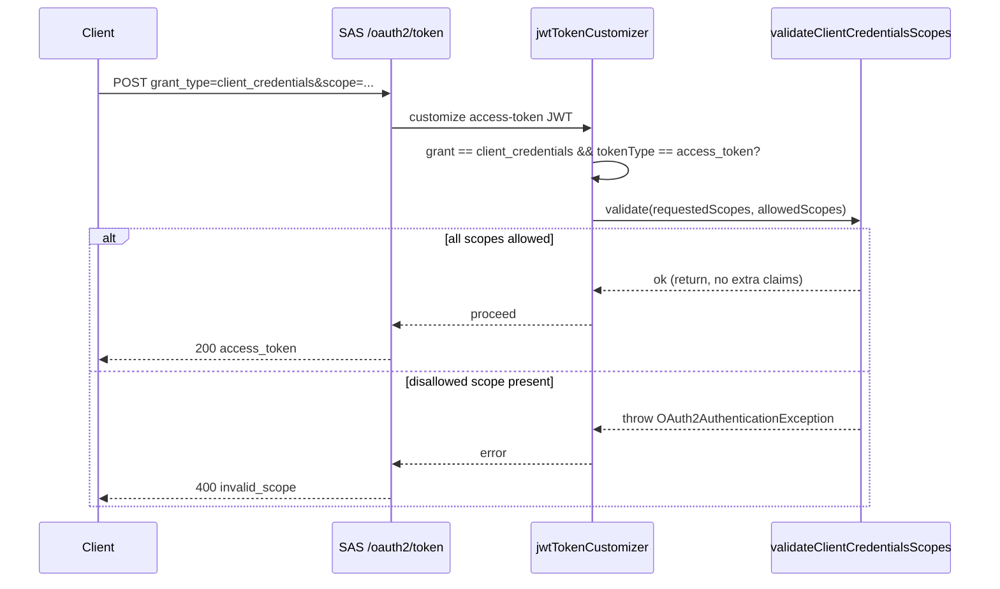

# Feature 4 — Token Policy & Lifetime Controls

Token behavior is configurable through `TokenPolicyProperties` (`@ConfigurationProperties(prefix = "app.token")`) without code changes.

## Properties

| Property | Type | Default | Effect |
|---|---|---|---|
| `app.token.access-token-time-to-live` | Duration | `5m` | Access token lifetime |
| `app.token.refresh-token-time-to-live` | Duration | `7d` | Refresh token lifetime |
| `app.token.reuse-refresh-tokens` | boolean | `false` | If `false`, each refresh issues a new refresh token (rotation) |
| `app.token.client-credentials-allowed-scopes` | Set | `read,write,introspection,revocation` | Scopes a `client_credentials` grant may request |

## Refresh token rotation

When `reuse-refresh-tokens=false` (default), every refresh exchange returns a fresh refresh token and invalidates the old one — limiting the blast radius of a leaked token. Set to `true` to keep a single long-lived refresh token.

## Client-credentials scope restriction

The `jwtTokenCustomizer` enforces that a `client_credentials` grant only requests scopes in `client-credentials-allowed-scopes`. A request for a scope outside this set is rejected with `invalid_scope`. This keeps machine clients from minting tokens for user-oriented scopes.

## Implementation

| Concern | Class / file |
|---|---|
| Property binding | [`tokens/TokenPolicyProperties`](../../src/main/java/io/github/edmaputra/enhauthserv/tokens/TokenPolicyProperties.java) (`@ConfigurationProperties("app.token")`, enabled via `@EnableConfigurationProperties` on `oauth/SecurityConfig`) |
| TTL / rotation wiring | `oauth/SecurityConfig.tokenSettings(...)` → `TokenSettings.builder().accessTokenTimeToLive().refreshTokenTimeToLive().reuseRefreshTokens()` |
| Scope guard | `oauth/SecurityConfig.jwtTokenCustomizer(...)` → private `validateClientCredentialsScopes(...)` |

Notes from the code:

- TTLs and rotation are applied by Spring Authorization Server through the `TokenSettings` bean — no per-request code runs for them.
- The client-credentials scope check runs **inside `jwtTokenCustomizer`** only when the grant is `client_credentials` and the token type is the access token. Allowed scopes are compared case-insensitively; a disallowed scope throws `OAuth2AuthenticationException(invalid_scope)`.

## Client-credentials scope guard — sequence

## Related tests

- `TokenPolicyControlsTests` — verifies access-token TTL, refresh rotation, and client-credentials scope enforcement.
