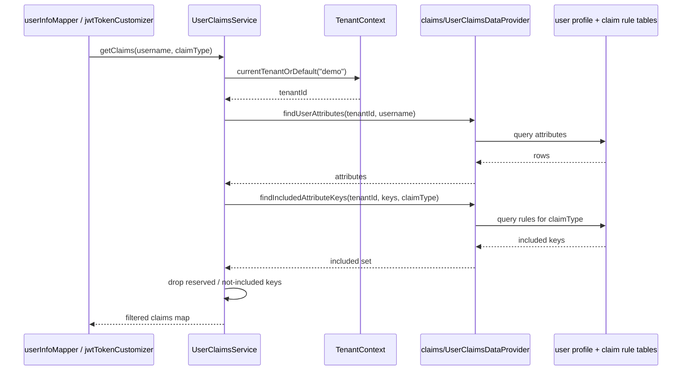

# Feature 5 — Dynamic Claims

Beyond the fixed profile fields, EnhAuthServ lets you attach arbitrary key/value attributes to a user and route each one to the UserInfo response, the ID token, the access token, or any combination — driven by data, not code.

## Data model

| Entity | Table | Role |
|---|---|---|
| `UserProfile` | `user_profiles` | Standard profile (name, email, locale, zoneinfo, department, tenant) |
| `UserProfileAttribute` | `user_profile_attributes` | Arbitrary `attribute_key` / `attribute_value` per user, per tenant |
| `ClaimInclusionRule` | `claim_inclusion_rules` | Maps an `attribute_key` → set of targets |
| `ClaimTarget` (enum) | — | `USERINFO`, `ID_TOKEN`, `ACCESS_TOKEN` |

`UserProfileAttribute` has a unique constraint on `(tenant_id, username, attribute_key)`. `ClaimInclusionRule.targets` is stored as a comma-separated list of `ClaimTarget` names.

## Resolution flow (`UserClaimsService`)

For a given username and target (`ClaimType.USERINFO` / `ID_TOKEN` / `ACCESS_TOKEN`):

1. Load the user profile (or build a default).
2. Load the user's attributes for the current tenant (via `TenantContext`).
3. Load the `ClaimInclusionRule`s for those attribute keys, scoped to the tenant.
4. For each attribute, include it **only if** its rule targets the requested type.
5. Skip any attribute whose key is a **reserved claim** (`sub`, `iss`, `aud`, `exp`, `iat`, `nbf`, `jti`, `scope`, `client_id`, `azp`, `token_type`, `auth_time`, `nonce`, `at_hash`, `c_hash`, `sid`, `amr`, `acr`).

The result is a `Map<String, Object>` merged into the token/userinfo output by the relevant customizer in `SecurityConfig`.

## Where claims are injected

| Target | Injection point |
|---|---|
| `USERINFO` | `userInfoMapper` bean → `/userinfo` response |
| `ID_TOKEN` | `jwtTokenCustomizer` → ID token JWT |
| `ACCESS_TOKEN` | `jwtTokenCustomizer` → access token JWT |

## Example (seeded demo data)

| Attribute | Value | Targets |
|---|---|---|
| `favorite_color` | `blue` | USERINFO, ACCESS_TOKEN |
| `employee_level` | `senior` | ID_TOKEN, ACCESS_TOKEN |
| `region` | `apac` | USERINFO, ID_TOKEN |

So `region` appears in UserInfo and the ID token, but never in the access token.

## Implementation

| Concern | Class / file |
|---|---|
| Claim service | [`claims/UserClaimsService`](../../src/main/java/io/github/edmaputra/enhauthserv/claims/UserClaimsService.java) (+ `ClaimType`, `UserAttributeData`, `UserProfileData`) |
| Claim data access | `claims/UserClaimsDataProvider` (`@Component` aggregating `users/UserProfileRepository`, `users/UserProfileAttributeRepository`, `claims/ClaimInclusionRuleRepository`) |
| Tenant resolution | `tenancy/TenantContext` |
| Feature models | `users/UserProfile`, `users/UserProfileAttribute`, `claims/ClaimInclusionRule`, `claims/ClaimTarget` |
| Feature repositories | `users/UserProfileRepository`, `users/UserProfileAttributeRepository`, `claims/ClaimInclusionRuleRepository` |
| Injection points | `oauth/SecurityConfig.userInfoMapper(...)`, `oauth/SecurityConfig.jwtTokenCustomizer(...)` |
| Seeding | `oauth/SecurityConfig` demo seeders (`demoUserProfileSeeder`, `demoUserProfileAttributeSeeder`, `demoClaimInclusionRuleSeeder`) |

Notes from the code:

- `UserClaimsService.getClaims` resolves the tenant via `TenantContext.getCurrentTenantOrDefault("demo")`, loads attributes, then asks `findIncludedAttributeKeys(tenant, keys, claimType)` for the subset whose rule targets the requested `ClaimType`.
- Each attribute is dropped if its key is blank, in `RESERVED_CLAIMS`, or not in the included set.
- `getOrDefaultProfile` falls back to a synthetic `UserProfileData` (`username@example.com`, `en-US`, `UTC`, …) when no profile data exists.

## Claims assembly — sequence

## Related tests

- `UserClaimsServiceTests` — filtering by `ClaimType`, reserved-claim exclusion.
- `OidcUserInfoEndpointTests` — end-to-end UserInfo claims.
