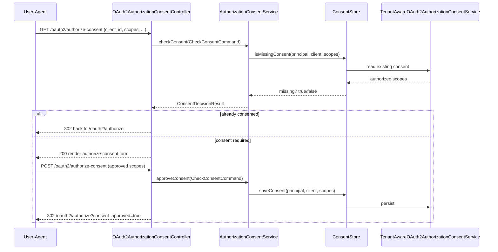

# Feature 8 — User Consent

During the authorization code flow, when a client requests scopes the user has not yet approved, EnhAuthServ presents a consent screen and records the decision.

## Endpoints

| Endpoint | Method | Purpose |
|---|---|---|
| `/oauth2/authorize-consent` | GET | Render the consent form (scope approval) |
| `/oauth2/authorize-consent` | POST | Process the user's approved scopes |

GET parameters: `client_id`, `requested_scopes`, `redirect_uri`, `state`.
POST adds `scope[]` — the subset of scopes the user approved — and redirects back to `/oauth2/authorize` with `consent_approved=true`.

## API contract

Both endpoints require an authenticated user session (form login). They are invoked by the browser during the authorization flow, not called directly by API clients.

### `GET /oauth2/authorize-consent`

| Query param | Required | Description |
|---|---|---|
| `client_id` | yes | Client requesting authorization |
| `requested_scopes` | yes | Space-delimited scopes |
| `redirect_uri` | yes | Client redirect URI |
| `state` | yes | Authorization-request state |

**Response:**

- `200 OK` — renders the `authorize-consent` view (scope approval form) when consent is required.
- `302 Found` to `/oauth2/authorize?...` when the user has already consented (no form shown).
- `200 OK` rendering `consent-error` if `client_id` is unknown.

### `POST /oauth2/authorize-consent`

`Content-Type: application/x-www-form-urlencoded`.

| Form param | Required | Description |
|---|---|---|
| `client_id` | yes | Client requesting authorization |
| `redirect_uri` | yes | Client redirect URI |
| `requested_scopes` | yes | Space-delimited scopes originally requested |
| `state` | yes | Authorization-request state |
| `scope` | no | Repeated param — each approved scope (omitted = none approved) |

**Response** — `302 Found` back to the authorization endpoint:

```http
Location: /oauth2/authorize?client_id=demo-client&response_type=code
          &redirect_uri=...&scope=openid+profile&state=xyz&consent_approved=true
```

## Flow (`AuthorizationConsentService`)

- `checkConsent(command)` → `ConsentDecisionResult`: determines whether the user (`principalName`) has already authorized the client for all requested scopes, via `ConsentStore`.
- `approveConsent(command)`: persists the approved scopes.

Consent records are stored in `oauth2_authorization_consent` and, like all OAuth2 state, are **tenant-scoped** through `TenantAwareOAuth2AuthorizationConsentService`. A returning user who already granted the requested scopes skips the screen.

## Implementation

| Concern | Class / file |
|---|---|
| Controller | [`consent/OAuth2AuthorizationConsentController`](../../src/main/java/io/github/edmaputra/enhauthserv/consent/OAuth2AuthorizationConsentController.java) |
| Service | [`consent/AuthorizationConsentService`](../../src/main/java/io/github/edmaputra/enhauthserv/consent/AuthorizationConsentService.java) (+ `CheckConsentCommand`, `ConsentDecisionResult`) |
| Storage | `consent/ConsentStore` |
| Consent store | `oauth/TenantAwareOAuth2AuthorizationConsentService` (tenant-scoped) |
| Client lookup | `RegisteredClientRepository` (for client name on the form) |
| Filter chain | included in `oauth/SecurityConfig` `@Order(2)` matcher (`/oauth2/authorize-consent`); authenticated |
| View | `authorize-consent` template (and `consent-error` for unknown clients) |

Notes from the code:

- The controller resolves `principalName` from the authenticated `Authentication`; scopes arrive space-delimited and are split into a `Set`.
- `checkConsent` consults `ConsentStore.isMissingConsent(...)`; if nothing is missing it redirects straight back to `/oauth2/authorize` without showing the form.
- `approveConsent` persists via `ConsentStore.saveConsent(...)` then redirects with `consent_approved=true`.

## Consent — sequence



## Related tests

- `AuthServerConsentFlowTests`, `AuthorizationConsentUseCaseTests`
