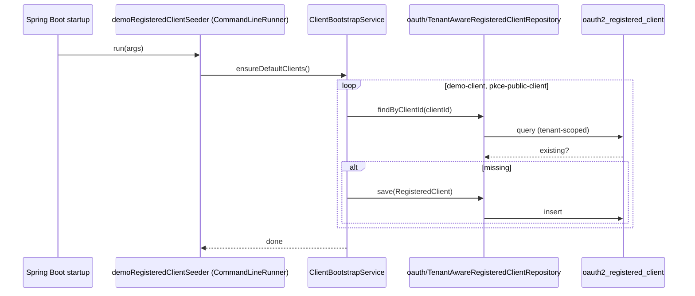

# Feature 9 — Client Management & Bootstrap

Registered OAuth2 clients are persisted in `oauth2_registered_client` and accessed through the tenant-aware `RegisteredClientRepository`. On startup, a set of demo clients is seeded for local development by `ClientBootstrapService`.

## Client storage

- `oauth/TenantAwareRegisteredClientRepository` (extends `JdbcRegisteredClientRepository`) stamps and filters `tenant_id` on save/lookup.
- `clients/ClientBootstrapService` seeds the built-in clients.
- `clients/ClientScopeService` answers `getClientScopes` / `clientHasScope`, used by the introspection and revocation policy checks.

## Bootstrap (`ClientBootstrapService`)

`ensureDefaultClients()` runs at startup (via a `CommandLineRunner` in `ClientsConfig`) and seeds:

### `demo-client` (confidential)
- Secret: `demo-secret` (BCrypt)
- Auth methods: `client_secret_basic`, `client_secret_post`
- Grants: `authorization_code`, `client_credentials`, `refresh_token`
- Redirect: `http://127.0.0.1:9000/login/oauth2/code/demo-client`
- Scopes: `openid`, `profile`, `email`, `read`, `write`, `introspection`, `revocation`

### `pkce-public-client` (public)
- Auth method: `none`; **PKCE required** (`requireProofKey(true)`)
- Grants: `authorization_code`
- Redirect: `http://127.0.0.1:9000/login/oauth2/code/pkce-public-client`
- Scopes: `openid`, `profile`, `email`, `read`

## Demo user seeding

`oauth/SecurityConfig` also seeds the demo end user and its identity data:

- **User** `demo-user` / `demo-password`, role `ROLE_USER`
- **Profile**: Demo User, `demo-user@example.com`, locale `en-US`, zoneinfo `Asia/Jakarta`, department `engineering`, tenant `demo`
- **Attributes + claim rules**: see [Dynamic Claims](05-dynamic-claims.md)

## Implementation

| Concern | Class / file |
|---|---|
| Bootstrap service | [`clients/ClientBootstrapService`](../../src/main/java/io/github/edmaputra/enhauthserv/clients/ClientBootstrapService.java) |
| Scope queries | `clients/ClientScopeService` |
| Client store | `oauth/SecurityConfig.registeredClientRepository(...)` → `oauth/TenantAwareRegisteredClientRepository` |
| Startup trigger | `clients/ClientsConfig.demoRegisteredClientSeeder(...)` (`CommandLineRunner @Order(1)`) |
| Token settings | `oauth/SecurityConfig.tokenSettings(...)` injected into the bootstrap service |
| User/profile seeders | `oauth/SecurityConfig.demoUserSeeder` / `demoUserProfileSeeder` / `demoUserProfileAttributeSeeder` / `demoClaimInclusionRuleSeeder` |

Notes from the code:

- `ClientBootstrapService` injects `RegisteredClientRepository`, `PasswordEncoder` (BCrypt), and `TokenSettings`.
- The seeder runs at startup; `ensureDefaultClients()` is idempotent (clients are only created if absent).
- The demo user (`demo-user`) is created via `JdbcUserDetailsManager`; profile/attribute/rule seeders run as ordered `CommandLineRunner`s after it.

## Startup bootstrap — sequence

## Related tests

- `ClientBootstrapServiceTests`
