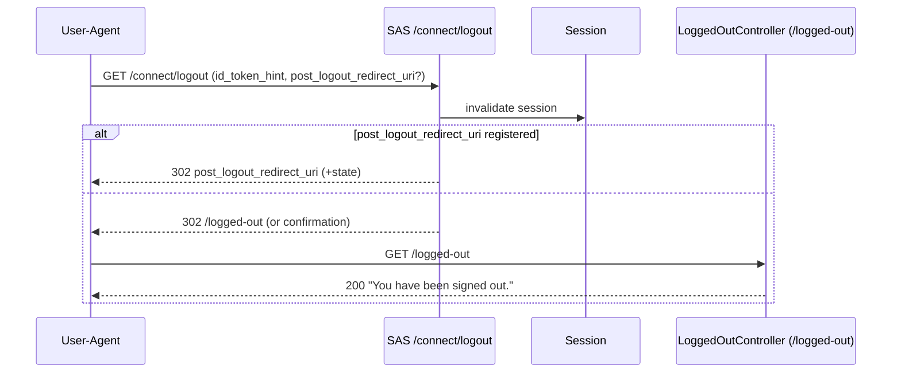

# Feature 10 — Session & Logout

EnhAuthServ supports interactive form login and OpenID Connect RP-initiated logout.

## Login

The default filter chain (`@Order(4)`) uses Spring Security form login. Unauthenticated requests to protected OAuth2 endpoints are redirected to `/login` via a `LoginUrlAuthenticationEntryPoint` (for HTML requests).

> Note: an unauthenticated call to `/oauth2/token` falls through to the login page rather than returning `invalid_client`. To force an error response in tests, pass explicit (invalid) credentials.

## Logout

| Endpoint | Method | Purpose |
|---|---|---|
| `/connect/logout` | GET | OIDC RP-initiated logout (`end_session_endpoint`) |
| `/logged-out` | GET | Post-logout confirmation page (`permitAll`) |

`/connect/logout` is advertised as the `end_session_endpoint` in the per-tenant discovery document. After logout, the user lands on `/logged-out`, served by `LoggedOutController` ("You have been signed out.").

## API contracts

### `GET /connect/logout`

OIDC RP-initiated logout (provided by Spring Authorization Server). Common parameters:

| Query param | Required | Description |
|---|---|---|
| `id_token_hint` | recommended | Previously issued ID token identifying the session |
| `post_logout_redirect_uri` | no | Registered URI to return to after logout |
| `state` | no | Opaque value echoed back to the redirect URI |
| `client_id` | no | Client requesting logout |

**Response** — terminates the session, then either renders the logout confirmation or issues a `302 Found` to `post_logout_redirect_uri` (with `state` appended) when one is supplied and registered.

### `GET /logged-out`

No auth. Static post-logout confirmation page.

**`200 OK`:**

```text
You have been signed out.
```

## Implementation

| Concern | Class / file |
|---|---|
| Form login | `oauth/SecurityConfig.defaultSecurityFilterChain` (`@Order(4)`, `formLogin(withDefaults())`) |
| Login redirect | `LoginUrlAuthenticationEntryPoint("/login")` in the `@Order(2)` chain's exception handling |
| Logout endpoint | Spring Authorization Server OIDC logout (`/connect/logout`), enabled by the AS configurer |
| Post-logout page | [`shared/LoggedOutController`](../../src/main/java/io/github/edmaputra/enhauthserv/shared/LoggedOutController.java) (`/logged-out`, permitAll) |
| Session plumbing | `oauth/SecurityConfig.sessionRegistry()`, `httpSessionEventPublisher()` |
| User store | `JdbcUserDetailsManager` (`oauth/SecurityConfig.userDetailsService(...)`) |

Notes from the code:

- `/connect/logout` is handled by Spring Authorization Server, not a project controller; `/logged-out` is the only custom piece here.
- `/logged-out` and the per-tenant discovery/JWKS paths are explicitly `permitAll` in the `@Order(4)` chain; everything else there requires authentication.

## Logout — sequence



## Related tests

- `OidcLogoutEndpointTests`
