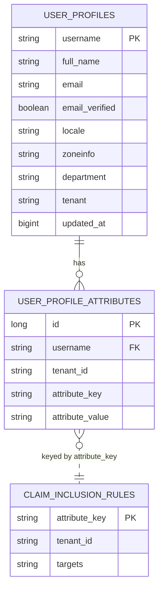

# Feature 11 — Persistence & Schema

State is persisted via Spring Data JPA and Spring Security's JDBC OAuth2 stores. Schema is managed by **Flyway** (`src/main/resources/db/migration/`). Default database is in-memory H2; any JDBC database can be substituted by overriding `spring.datasource.*`.

## Migrations

| Version | Summary |
|---|---|
| `V0_0_1_001` | Core OAuth2 tables: `oauth2_registered_client`, `oauth2_authorization`, `oauth2_authorization_consent` |
| `V0_0_1_002` | Spring Security user tables: `users`, `authorities` |
| `V0_0_1_003` | `user_profiles` (extended identity fields) |
| `V0_0_1_004` | `user_profile_attributes` (key/value attributes) |
| `V0_0_1_005` | `claim_inclusion_rules` (attribute → token targets) |
| `V0_0_1_006` | Drop legacy boolean flag columns from `user_profile_attributes` (superseded by claim rules) |
| `V0_0_1_007` | Add `tenant_id` discriminator + indexes across OAuth2, user, and profile tables |

## Application tables

| Table | Feature model | Key |
|---|---|---|
| `user_profiles` | `users/UserProfile` | `username` |
| `user_profile_attributes` | `users/UserProfileAttribute` | `id`; unique `(tenant_id, username, attribute_key)` |
| `claim_inclusion_rules` | `claims/ClaimInclusionRule` | `attribute_key` |

## Spring-managed tables

`oauth2_registered_client`, `oauth2_authorization`, `oauth2_authorization_consent`, `users`, `authorities` — all carry a `tenant_id` column (default `demo`) after `V0_0_1_007`.

## Repositories

| Repository | Notable finders |
|---|---|
| `users/UserProfileRepository` | `findByUsername`, `findByTenantAndUsername` |
| `users/UserProfileAttributeRepository` | `findByTenantIdAndUserProfileUsername`, `existsByTenantIdAndUserProfileUsernameAndAttributeKey` |
| `claims/ClaimInclusionRuleRepository` | `findByTenantIdAndAttributeKeyIn`, `findByTenantIdAndAttributeKey` |

## Switching databases

Override the datasource (example PostgreSQL):

```properties
spring.datasource.url=jdbc:postgresql://localhost:5432/enhauth
spring.datasource.username=enhauth
spring.datasource.password=secret
spring.datasource.driver-class-name=org.postgresql.Driver
```

> Integration-test note: H2 state can leak between Spring contexts. When overriding properties in a test, give it a unique `spring.datasource.url` in `@TestPropertySource`.

## Implementation

| Concern | Class / file |
|---|---|
| Migrations | `src/main/resources/db/migration/V0_0_1_00{1..7}__*.sql` |
| Feature models | `users/UserProfile`, `users/UserProfileAttribute`, `claims/ClaimInclusionRule`, `claims/ClaimTarget` |
| Feature repositories | `users/UserProfileRepository`, `users/UserProfileAttributeRepository`, `claims/ClaimInclusionRuleRepository` |
| OAuth2 JDBC stores | `oauth/TenantAware*` (extend Spring's `Jdbc*` stores) |
| Datasource/Flyway config | `src/main/resources/application.properties` |

Notes from the code:

- The application data tables (`user_profiles`, `user_profile_attributes`, `claim_inclusion_rules`) are managed by **JPA**; the OAuth2 protocol tables are managed by Spring Security's **JDBC** stores (tenant-aware subclasses).
- `ClaimInclusionRule.targets` is a single comma-separated column; `addTarget`/`includesTarget` maintain it.
- `UserProfile` ↔ `UserProfileAttribute` is a `@OneToMany` (cascade delete, lazy).

## Entity relationships



> The link between attributes and rules is **by `attribute_key` (within a tenant)**, not a database foreign key — it is resolved in code by `claims/UserClaimsService` via `claims/UserClaimsDataProvider`.
